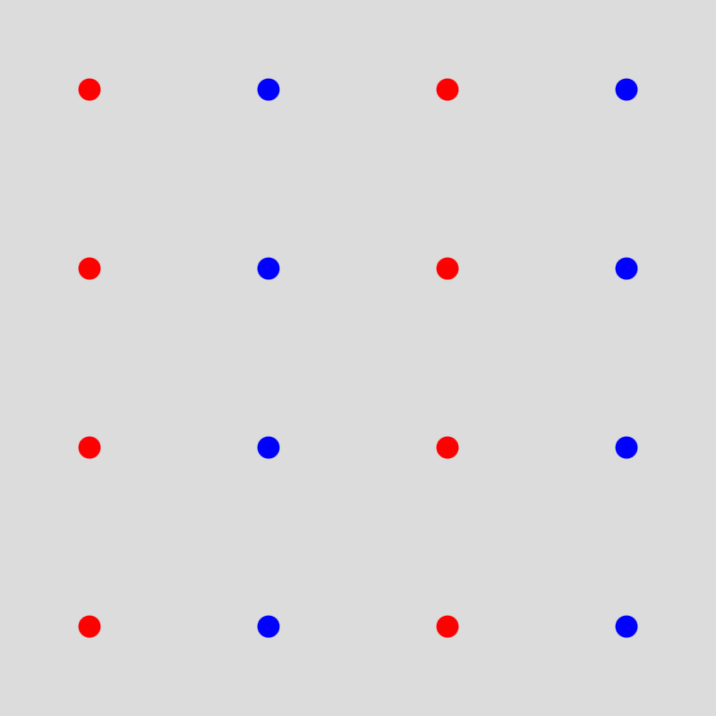
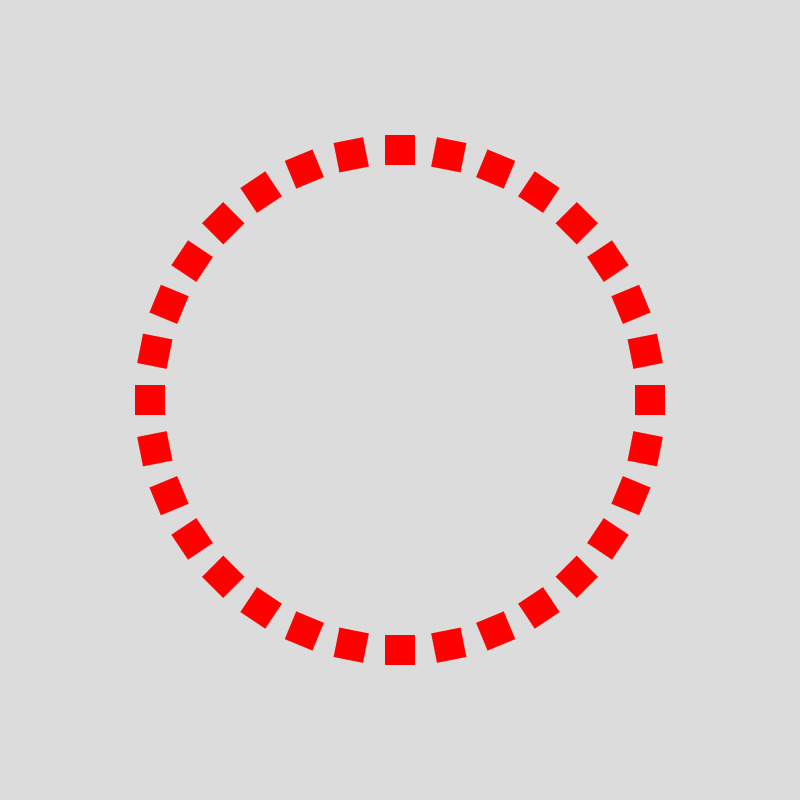
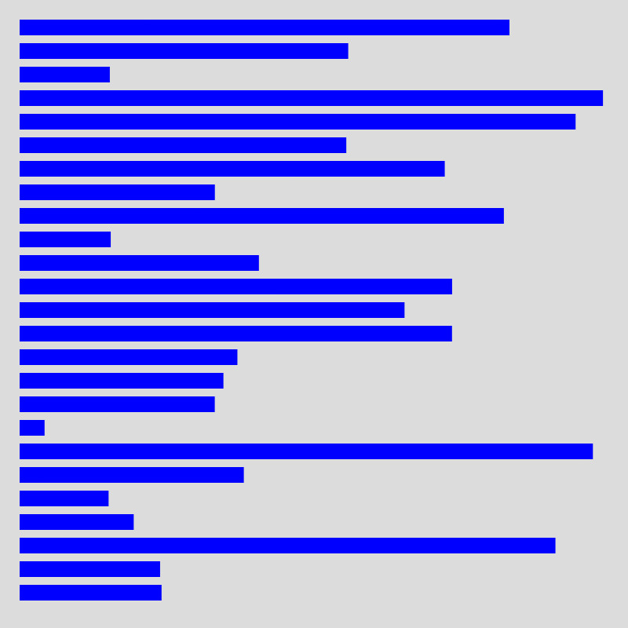
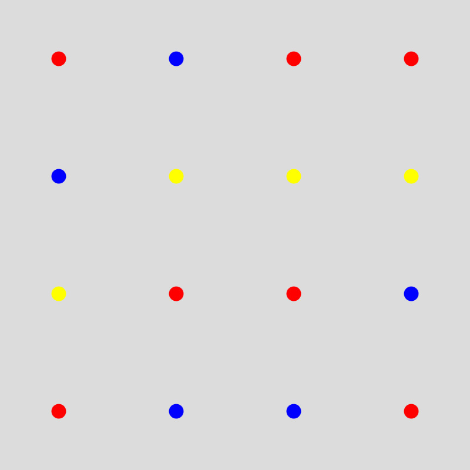
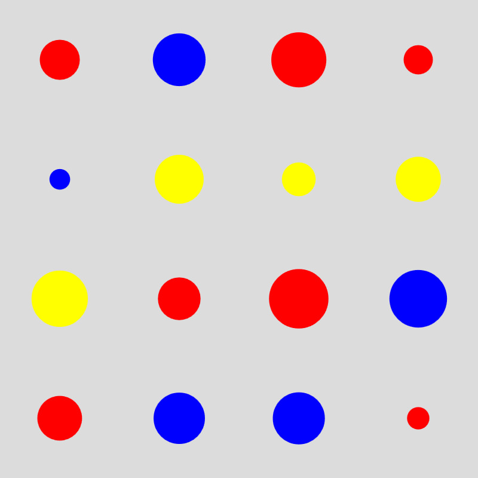
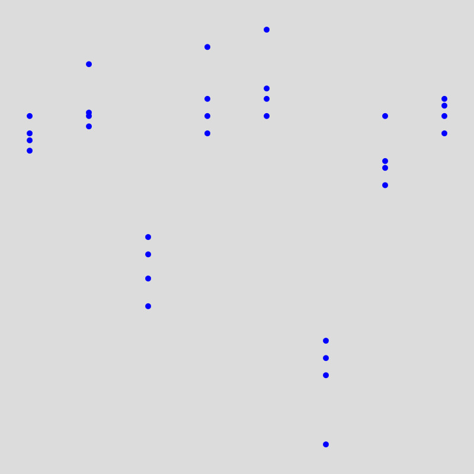
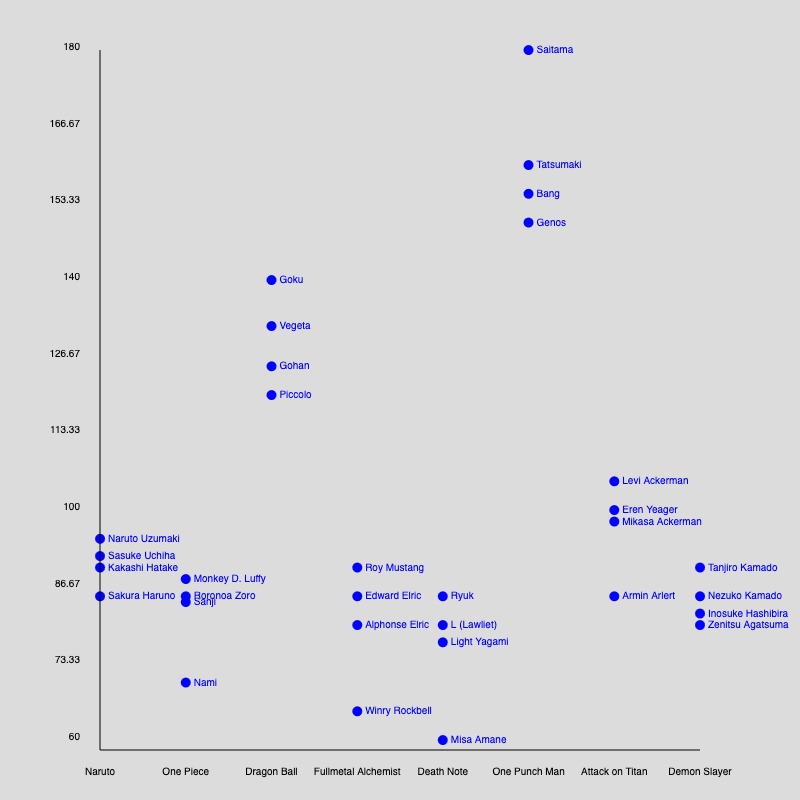
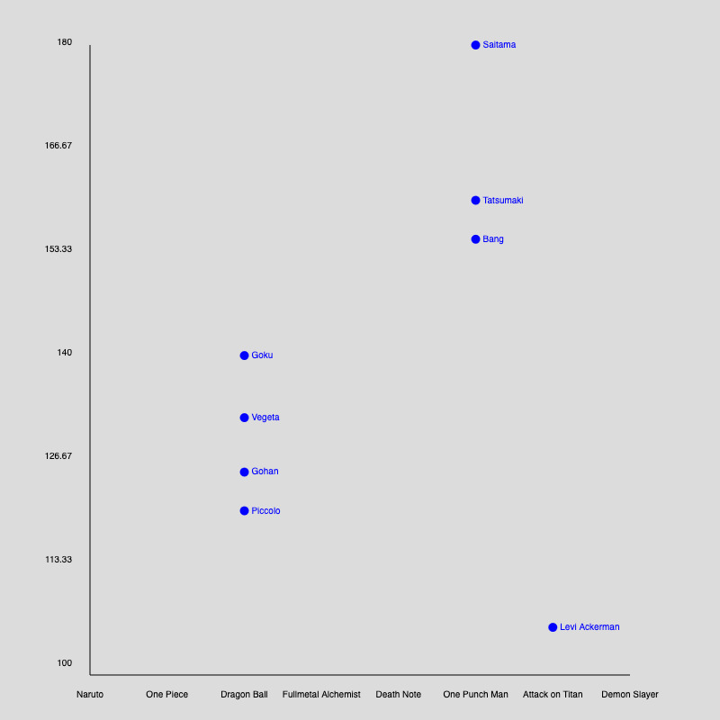

# HS24 Code Lab Refresh

Refresh your coding skills! 🌈

## Hilfsmittel

- Coding Train Tutorials: 
	- [Nested Loops](https://www.youtube.com/watch?v=1c1_TMdf8b8) um Grids zu erstellen.
	- [Polar-Coordinates](https://www.youtube.com/watch?v=N633bLi_YCw) um im Kreis zu zeichnen.
	- [Conditional Statements](https://www.youtube.com/watch?v=1Osb_iGDdjk) für If/Else.
	- [Arrays](https://www.youtube.com/watch?v=VIQoUghHSxU) in Javascript.
	- [Arrays & Loops](https://www.youtube.com/watch?v=RXWO3mFuW-I) in Javascript.
	- [Functions](https://www.youtube.com/watch?v=wRHAitGzBrg) in Javascript.
- P5js [Reference Page](https://p5js.org/reference/)
- D3 [Reference Page](https://d3js.org/getting-started)
- DD+A Github[ Code Sketchbook](https://github.com/hslu-dda/dda-sketchbook)
- DD+A Github Data [Handling Repository](https://github.com/hslu-dda/data-handling)

## Übung 1: Grundlagen Zeichnen

- Zeichne 16 Kreise in einem regelmäßigen Raster, gleichmäßig auf dem Canvas verteilt.
- Verwende eine Variable für die Anzahl der Kreise, damit du diese dynamisch verändern kannst.
- Definiere zwei Farben: Färbe die Kreise mit gerader Anzahl in der einen Farbe und die mit ungerader Anzahl in der anderen.

Tipps:
- Du brauchst dazu: Schleifen (sogar zwei), Farben, `ellipse()`, Variablen, If/Else und den Modulo-Operator.

## Übung 2: Grundlagen Zeichnen

- Zeichne 32 Rechtecke, die regelmäßig in einem Kreis angeordnet sind. Verwende dazu `sin()` und `cos()`. Außerdem ist `angleMode(DEGREES)` hilfreich.
- Die Rechtecke sollten rotieren und sich alle zur Mitte des Kreises hin orientieren. Verwende dazu `push()` und `pop()`.

Tipps:
- Du brauchst dazu `translate()`, `angleMode()`, Schleifen, `sin()` und `cos()`, sowie `push()` und `pop()`.

## Übung 3: Grundlagen Zeichnen

- Zeichne ein einfaches Balkendiagramm. Die Balken sollen auf der linken Seite ausgerichtet sein, und die Länge der Balken ist zufällig.

Tipps:
- Du brauchst dazu Schleifen und `random()`.

## Übung 4: Grundlagen Daten Visualisieren

- Dupliziere den Sketch mit den 16 Kreisen.
- Lade die mitgegebene JSON-Datei manga.json mithilfe der Funktion `d3.json`.
- Färbe die Kreise entsprechend den drei Kategorien (“One Piece”, “Naruto”, oder “Dragon Ball”) ein.

Tipps:
- Du musst überlegen, wie du innerhalb der Schleife auf das Datenobjekt zugreifen kannst, dazu benötigst du einen Array-Index. Außerdem musst du beachten, dass die Daten nicht von Anfang an vorhanden sind, was zu Fehlern führen kann. Ein If-Statement sowie `noLoop()` und `redraw()` könnten hier hilfreich sein.

## Übung 5: Grundlagen Daten Visualisieren

- Verwende den Sketch aus Übung 4.
- Verwende die Werte von value aus manga.json, um die Größe der Kreise zu bestimmen. Nutze dazu die d3-Skalierung `scaleSqrt`.

Tipps:
- In Think 1 bei Christian seid ihr in d3-Scales eingeführt worden. Einen der dazugehörigen Sketches (sdg-d3-scales) findet ihr im [DD+A Sketchbook](https://github.com/hslu-dda/dda-sketchbook/tree/main) auf Github.

## Übung 6: Grundlagen Daten Visualisieren

- Lege einen neuen Sketch an und lade die CSV-Datei `manga_characters.csv` mit `d3.csv`.
- Ziel ist es, alle Manga-Charaktere anhand ihrer Kategorie und ihres Power-Levels in einem Plot zu visualisieren.
- Lege eine X- und Y-Achse an und verwende dazu scaleLinear und scalePoint von d3. Der Datensatz enthält fünf Kategorien (“Naruto”, “One Piece”, “Dragon Ball”, “Fullmetal Alchemist”, “Death Note”, “One Punch Man”, “Attack on Titan”, “Demon Slayer”). Das Power-Level liegt zwischen 60 und 180.
- Falls du eine schwierigere Herausforderung möchtest, kannst du versuchen, die Kategorien und das min/max direkt aus den geladenen Daten im Code zu ermitteln. Hilfreich sind dabei die Funktionen `d3.min` und `d3.max`. Sieh dir dazu unser [Data Handling Repository](https://github.com/hslu-dda/data-handling) auf Github an. Alternativ kannst du die Kategorien und das min/max auch direkt im Code deklarieren.

Tipps:
- Du musst auf die Werte Category und Power Level aus dem Datensatz zugreifen, um die X- und Y-Position deiner Ellipsen zu ermitteln. Falls du nicht mehr weißt, wie das geht, sieh dir den Bereich “Working with Objects” in unserem [Data Handling Repository](https://github.com/hslu-dda/data-handling) auf Github an.
- Da die Daten nicht von Anfang an vorhanden sind, können Fehler auftreten. Ein If-Statement sowie `noLoop()` und `redraw()` könnten dabei hilfreich sein.

## Übung 7: Typografie

- Kopiere den Sketch aus Übung 6.
- Füge jedem der Charaktere ein Label mit dessen Namen hinzu.
- Ergänze eine X- und Y-Achse, damit man die Werte ablesen kann.

Tipps:
- Du benötigst dazu `text()` sowie `line()`. Um die Achsen mit den Kategorien (“Naruto”, “One Piece”, “Dragon Ball” etc.) sowie den Power-Levels (60-180) zu versehen, brauchst du diese Daten, eine Schleife und einen Weg, die Position der Labels zu berechnen.

## Übung 8: Daten bearbeiten

- Kopiere den Sketch aus Übung 7.
- Du interessierst dich nun vor allem für Manga-Charaktere, die älter als 20 sind und ein Power-Level haben, das höher ist als 100.
- Schreibe dazu eine Funktion `filteredData()`, in der du die Daten filterst, bevor du mit der Visualisierung beginnst.
- Rufe die Funktion auf und verwende die gefilterten Daten. Nutze eine Schleife, um über die einzelnen Datenpunkte zu iterieren. Du brauchst außerdem ein If-Statement mit mehreren kombinierten Bedingungen (`&&`) sowie die `push()`-Funktion von Arrays.
- Nutze `return`, um die gefilterten Daten für die Visualisierung zurückzugeben.
- Passe die Achse des Power-Levels entsprechend an.

Tipps:
- Sieh dir den Bereich “Functions” in unserem [Data Handling Repository](https://github.com/hslu-dda/data-handling) auf Github an. Du kannst sowohl eine normale Schleife als auch ein forEach verwenden.
- Da sowohl Alter als auch Power-Level im Datensatz als Strings vorliegen, musst du sie zuerst in 

## Übung 9: Dynamische Daten (Freiwillig)

- Wähle eine der öffentlichen APIs von [freepublicapis.com](https://www.freepublicapis.com/).
- Erstelle eine kleine Datenvisualisierung, die du am 21.10. mitbringst, verwende nicht länger als 20 Minuten dafür. 

Tipps:  
- Sieh dir den Sketch [vam-api-call](https://github.com/hslu-dda/dda-sketchbook/tree/main/vam-api-call) im Sketchbook auf Github an. Den gleichen Code haben wir im Share 1 verwendet, um mit der VAM-API zu arbeiten.
- In den meisten Fällen wirst du die Funktion `d3.json` verwenden können.

